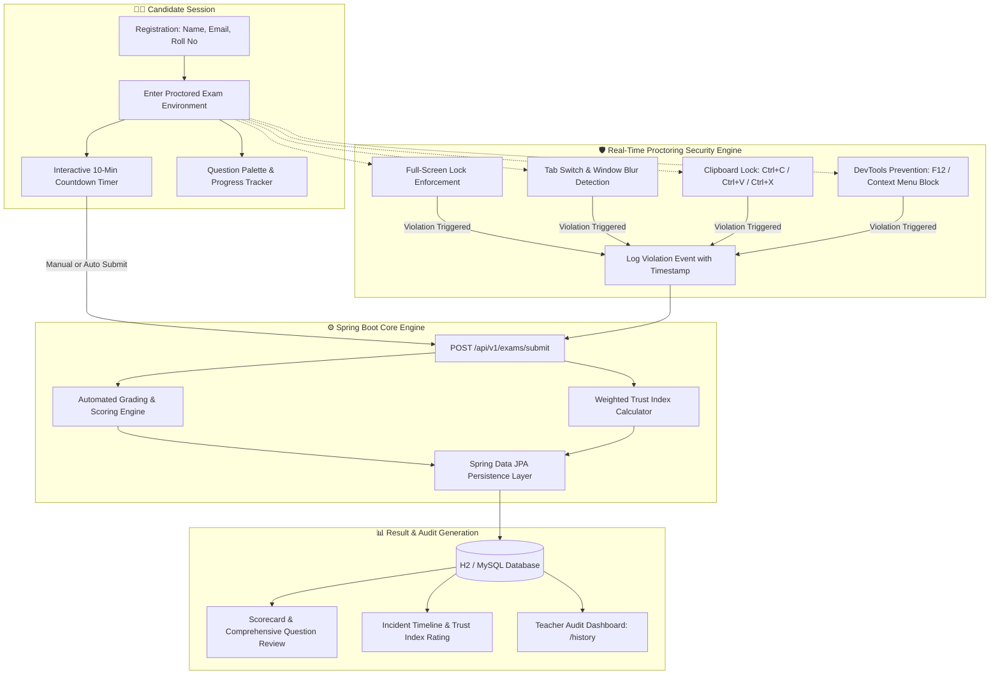

# 🎓 Online Examination & Proctoring System

[](https://online-examination-system-dcoc.onrender.com)
[](https://www.oracle.com/java/)
[](https://spring.io/projects/spring-boot)
[](https://www.mysql.com/)
[](Dockerfile)
[](src/test/)
[](LICENSE)

> A modern, robust, full-featured **Spring Boot web application** designed for conducting secure online examinations with real-time browser proctoring security, dynamic candidate analytics, weighted Trust Index computation, automated grading, teacher question management, and a complete RESTful JSON API.

---

## 🔗 Live Application & Portals

- 🌐 **Live Public Portal:** [online-examination-system-dcoc.onrender.com](https://online-examination-system-dcoc.onrender.com)
- 📊 **Teacher / Admin Audit Dashboard:** [online-examination-system-dcoc.onrender.com/history](https://online-examination-system-dcoc.onrender.com/history)
- 📝 **Question Bank Management:** [online-examination-system-dcoc.onrender.com/admin/questions](https://online-examination-system-dcoc.onrender.com/admin/questions)
- 🐙 **GitHub Repository:** [github.com/ranjithbrs/Online-Examination-System](https://github.com/ranjithbrs/Online-Examination-System)

---

## 📑 Table of Contents
- [Architecture & Proctoring Workflow](#-architecture--proctoring-workflow)
- [Key Features](#-key-features)
- [REST API Specifications](#-rest-api-specifications)
- [Technology Stack](#-technology-stack)
- [Local Setup & Development](#-local-setup--development)
- [Cloud Deployment (Render / Docker)](#-cloud-deployment-render--docker)
- [Automated Testing Suite](#-automated-testing-suite)
- [Repository Structure](#-repository-structure)
- [Author & Connect](#-author)
- [License](#-license)

---

## 📐 Architecture & Proctoring Workflow



---

## 🌟 Key Features

### 👨‍🎓 Candidate Examination Portal
- **Zero-Friction Registration**: Quick candidate onboarding with Name, Email, and Roll Number validation.
- **Synchronized Countdown Timer**: 10-minute active exam timer with automatic graceful submission at `00:00`.
- **Dynamic Question Navigation Grid**: Interactive palette tracking answered, unvisited, and marked questions.
- **Live Progress Bar**: Visual progress indicator updating dynamically as answers are selected.

### 🔒 Proctoring Security Engine
- **Full-Screen Locking**: Enforces HTML5 full-screen mode throughout the exam session; warns user on exit.
- **Tab Switch & Focus Loss Monitoring**: Tracks browser tab switches, OS application changes, and window minimize events.
- **Clipboard & DevTools Blocking**: Disables `Ctrl+C`, `Ctrl+V`, `Ctrl+X`, right-click context menus, `F12`, and DevTools key combinations (`Ctrl+Shift+I`).
- **Instant Warning Alerts**: Displays real-time warning toasts upon policy infractions without disrupting exam progress.

### 📊 Academic Performance & Integrity Analytics
- **Weighted Trust Index Score**: Evaluates academic integrity by applying penalty coefficients to recorded security violations:
  $$\text{Trust Index} = \max\left(0, 100 - \sum (\text{Severity Weight} \times \text{Incidents})\right)$$
- **Proctoring Incident Timeline**: Chronological log of infractions with exact timestamps for administrative review.
- **Detailed Question Review**: Explanations for correct/incorrect answers **persisted to the relational database**, ensuring permanent availability.
- **🖨️ PDF Export & Print**: One-click printable examination transcript for official records.

### 🏫 Teacher & Administrator Tools
- **Live Audit Dashboard (`/history`)**: Filter candidate submissions with live search across name, email, or roll number.
- **Question Bank CRUD (`/admin/questions`)**: Real-time management interface to create, update, or remove exam questions on-the-fly without server restarts.

---

## 📡 REST API Specifications

The application includes a clean RESTful JSON API for integrations and headless testing:

| Method | Endpoint | Description | Access |
| :--- | :--- | :--- | :--- |
| `GET` | `/api/v1/questions` | Retrieves all active exam questions | Public |
| `GET` | `/api/v1/questions/{id}` | Retrieves a single question by ID | Public |
| `POST` | `/api/v1/exams/submit` | Submits candidate answers & violations payload | Public |
| `GET` | `/api/v1/results` | Lists all candidate exam results | Public / Teacher |
| `GET` | `/api/v1/results/{id}` | Fetches detailed result & review for a candidate | Public / Teacher |
| `GET` | `/health` | Health check probe for uptime monitoring | Public |

---

## 🛠️ Technology Stack

- **Backend Framework**: Java 21, Spring Boot 3.5, Spring Data JPA, Spring MVC, Spring Validation, Thymeleaf
- **Frontend Architecture**: HTML5, Vanilla JavaScript (ES6+), Custom Glassmorphism CSS Design System
- **Database Support**: H2 In-Memory (default for instant local development) & MySQL 8.x (production profile)
- **Containerization**: Multi-stage production Dockerfile (`eclipse-temurin:21-jre-jammy`)
- **Testing**: JUnit 5, Spring Boot Test, MockMvc (7 automated unit & integration tests)
- **Hosting**: Render Cloud Platform

---

## 🚀 Local Setup & Development

### Prerequisites
- **JDK 21** or higher installed.
- Maven (or use included `./mvnw` / `mvnw.cmd`).

### 1. Clone the Repository
```bash
git clone https://github.com/ranjithbrs/Online-Examination-System.git
cd Online-Examination-System
```

### 2. Run with H2 In-Memory Database (Default)
```bash
# Windows
.\mvnw.cmd spring-boot:run

# Linux / macOS
./mvnw spring-boot:run
```

### 3. Run with MySQL Profile (Production Mode)
Configure credentials in `src/main/resources/application-mysql.properties`, then execute:
```bash
./mvnw spring-boot:run -Dspring-boot.run.profiles=mysql
```

### 🔗 Local Endpoints
- **Candidate Portal:** `http://localhost:8080/`
- **Audit Dashboard:** `http://localhost:8080/history`
- **Question Bank:** `http://localhost:8080/admin/questions`
- **H2 Console:** `http://localhost:8080/h2-console` *(JDBC URL: `jdbc:h2:mem:examdb`)*

---

## 🐳 Running with Docker

```bash
# 1. Build Docker image
docker build -t online-exam-system .

# 2. Run container
docker run -p 8080:8080 online-exam-system
```

---

## ☁️ Cloud Deployment (Render / Docker)

Pre-configured for automated continuous deployment using `render.yaml` or `Dockerfile`:
- Automatically binds to dynamic cloud `$PORT`.
- Configured health check probe at `/health`.
- Persistent MySQL connection supported via environment variables (`DB_URL`, `DB_USERNAME`, `DB_PASSWORD`).

---

## 🧪 Automated Testing Suite

Comprehensive unit and integration tests covering context initialization, question seeding, grading logic, proctoring violation tracking, answer persistence, question CRUD, and REST endpoints:

```bash
# Windows
.\mvnw.cmd test

# Linux / macOS
./mvnw test
```

Expected output:
```text
Tests run: 7, Failures: 0, Errors: 0, Skipped: 0
[INFO] BUILD SUCCESS
```

---

## 📁 Repository Structure

```text
Online-Examination-System/
├── Dockerfile                          # Multi-stage production container build
├── render.yaml                         # Cloud PaaS deployment configuration
├── pom.xml                             # Maven build & dependency definitions
├── README.md                           # Comprehensive project documentation
└── src/
    ├── main/java/com/examsystem/onlineexam/
    │   ├── OnlineexamApplication.java  # Spring Boot application entrypoint
    │   ├── HomeController.java         # MVC controller (exam, result, audit views)
    │   ├── config/DataInitializer.java # Question bank database seeder
    │   ├── controller/                 # REST API controllers
    │   ├── dto/                        # Validated Data Transfer Objects
    │   ├── exception/                  # Global exception & error handler
    │   ├── model/                      # JPA Entities (ExamResult, Question, ViolationLog)
    │   ├── repository/                 # Spring Data JPA repositories
    │   └── service/ExamService.java    # Grading engine & Trust Index logic
    ├── main/resources/
    │   ├── application.properties      # H2 default configuration
    │   ├── application-mysql.properties# Production MySQL configuration
    │   ├── static/css/styles.css       # Dark mode design tokens
    │   └── templates/                  # Thymeleaf dynamic views
    └── test/                           # Automated JUnit 5 test suite
```

---

## 👨‍💻 Author

**Ranjith B**  
🎓 *B.Tech Computer Science & Business Systems (CSBS)*  
🏛️ *Nehru Institute of Engineering and Technology, Coimbatore*  

- 💼 **LinkedIn**: [linkedin.com/in/ranjith-b-85907831a](https://linkedin.com/in/ranjith-b-85907831a)  
- 🐙 **GitHub**: [github.com/ranjithbrs](https://github.com/ranjithbrs)  
- 🌐 **Portfolio**: [ranjithbrs.github.io/portfolio](https://ranjithbrs.github.io/portfolio/)  
- 📧 **Email**: ranjithb2k06@gmail.com  

---

## 📄 License

Distributed under the [MIT License](LICENSE).
